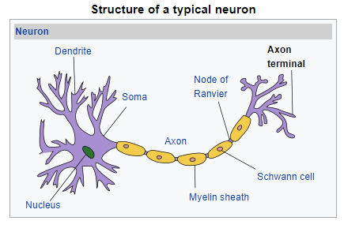
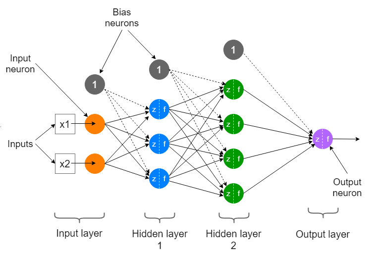

### Deep Learning Applications

1. **Color Restoration**: Especially convolutional neural networks (CNNs), are trained to predict the most plausible colors for each pixel based on the surrounding context.
  
2. **Audio to Video**

3. **Video to Video**

4. **Automatic Handwriting Generation**

5. **Automatic Machine Translation**

6. **Adding Sound to Silent Videos**

7. **Vehicle Autonomity** -> Lane rocgnition

---

### Neural Network Components



- **Neurons**: Inspired by biological neurons, an artificial neuron consists of:
  - **Dendrites**: Inputs to the neuron.
  - **Soma**: The body where the inputs are processed.
  - **Axon**: Sends the processed signal.
  - **Synapse**: The connection between neurons.

- **Artificial Neural Networks (ANNs)**: These mimic the structure of biological neural networks, using multiple layers of neurons connected by weights.


---

### Neural Network Topics

#### 1. **Forward Propagation**
   - The process of feeding input data through the network to get an output prediction. This is achieved by passing the input through successive layers of neurons, where each layer applies a transformation via weights and biases.

#### 2. **Backward Propagation** (Related to **Gradient Descent Algorithm**)
   - A method to adjust the weights and biases of the neural network after calculating the error.
   - **Steps**:
     1. Calculate the error between the predicted output and the ground truth.
     2. Iteratively adjust weights and biases to minimize the error using **Gradient Descent**:
        - \( w_1 = w_1 - n \cdot \frac{\partial E}{\partial w_1} \)
        - \( b_1 = b_1 - n \cdot \frac{\partial E}{\partial b_1} \)
        - Here, \( n \) is the learning rate.

   - **Vanishing Gradient Problem**: When using activation functions like Sigmoid or Tanh, gradients become smaller during backpropagation, especially with deep networks. This causes slow learning or network failure, as small values get multiplied during the backward pass.

#### 3. **Activation Functions** (Critical for Non-Linearity)
   - **Binary Step Function**: Simple threshold-based activation, not suitable for complex problems.
   - **Linear Function**: Doesn't solve the problem of non-linearity, hence seldom used.
   - **Sigmoid Function**: 
     - Formula: \( a = \frac{1}{1 + e^{-z}} \)
     - Output is between 0 and 1, but suffers from the vanishing gradient problem for values beyond +3 or -3.
     - Not symmetric around zero, limiting its learning capability.
   - **Hyperbolic Tangent (Tanh) Function**:
     - Formula: \( a = \frac{e^z - e^{-z}}{e^z + e^{-z}} \)
     - Scales output between -1 and 1, but also suffers from vanishing gradients.
   - **ReLU (Rectified Linear Unit)**: 
     - Formula: \( a = \max(0, z) \)
     - Avoids vanishing gradients by making negative inputs zero and keeping positive inputs as-is. 
     - Most widely used in hidden layers due to its simplicity and effectiveness.
   - **Leaky ReLU**: Allows a small, non-zero output for negative inputs to mitigate issues in ReLU.
   - **Softmax Function**: 
     - Used for multi-class classification.
     - Formula: \( a(i) = \frac{e^{z(i)}}{\sum_{k=1}^{m} e^{z(k)}} \)

- **Key Insights**:
  - **Sigmoid** and **Tanh** are less used due to the vanishing gradient issue.
  - Start with **ReLU**; switch to other functions only if necessary.

---

### Key Equations
1. \( z_1 = x_1 \cdot w_1 + b_1 \)
2. \( a_1 = f(z_1) \)
3. \( z_2 = a_1 \cdot w_2 + b_2 \)
4. \( a_2 = f(z_2) \)
5. Error \( E = (T - a_2) \)

- Without activation functions, a neural network reduces to **linear regression**, while activation functions enable the network to learn complex patterns by introducing non-linearity.


Here is a graph representing the common activation functions (Sigmoid, Tanh, ReLU, Leaky ReLU). You can download the image from the link below and embed it in your Markdown or R Markdown document.

[Download Activation Functions Graph](sandbox:/mnt/data/activation_functions_graph.png)

### Example Markdown (or R Markdown) code to include the image:

```markdown
# Activation Functions Graph

Below is a graph of commonly used activation functions:

```


This will embed the image directly into your markdown file if the image is located in the same directory.