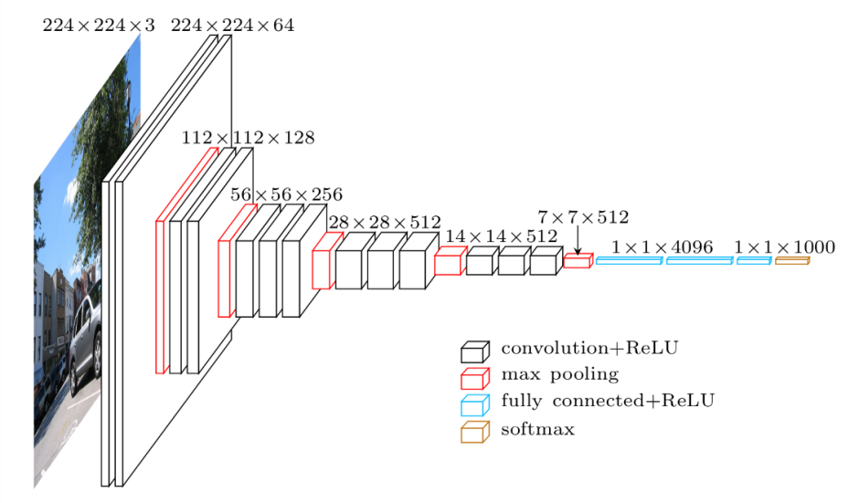

### Convolutional Neural Networks (CNNs)
- **Overview**: CNNs are neural networks specifically designed to process images, making training more efficient for image-related tasks.
- **Applications**: Image recognition, object detection, and computer vision tasks.
- **Image input format**:
  - Grayscale images: \( n \times m \times 1 \)
  - Colored images: \( n \times m \times 3 \)
  
- **Convolutions**: Dot product operation across the input matrix. Example:
  - Each \(2 \times 2\) section of the matrix is multiplied by:
    \[
    \begin{bmatrix} 0 & 1 \\ 0 & 1 \end{bmatrix}
    \]
  - Output size is reduced from \( n \times m \) to \( (n-1) \times (m-1) \).

- **Pooling Layer**:
  - **Max pooling**: Takes the maximum value from each \(2 \times 2\) section.
  - **Average pooling**: Averages the values from each \(2 \times 2\) section.
  - Output size is halved: \( n \times m \rightarrow \frac{n}{2} \times \frac{m}{2} \).

- **Fully Connected Layer**: A \(1 \times n\) matrix where every value is connected to all neurons in the next layer.



### Advanced CNN Architectures

#### VGG Architecture


#### ResNet Architecture
- **Addressing the Vanishing Gradient Problem**: ResNet introduces residual connections, allowing gradients to flow more easily through the network.
- **Identity Mapping**: Facilitates the learning of identity mappings, making it easier to train deeper networks.

```python
# Sample ResNet Block Implementation
def residual_block(x, filters, kernel_size=3, stride=1):
    shortcut = x
    x = Conv2D(filters, kernel_size, strides=stride, padding='same')(x)
    x = BatchNormalization()(x)
    x = Activation('relu')(x)
    x = Conv2D(filters, kernel_size, strides=1, padding='same')(x)
    x = BatchNormalization()(x)
    x = Add()([x, shortcut])  # Add shortcut connection
    x = Activation('relu')(x)
    return x
```

#### Inception Networks
- **Multiscale Feature Extraction**: Inception networks utilize filters of varying sizes within the same layer to capture features at multiple scales, improving performance on complex tasks.

---

### Example Model Structure (VGG-like)

```python
from tensorflow.keras.models import Sequential
from tensorflow.keras.layers import Conv2D, MaxPooling2D, Flatten, Dense

model = Sequential([
    Conv2D(64, (3, 3), activation='relu', input_shape=(64, 64, 3)),
    Conv2D(64, (3, 3), activation='relu'),
    MaxPooling2D((2, 2)),
    Conv2D(128, (3, 3), activation='relu'),
    Conv2D(128, (3, 3), activation='relu'),
    MaxPooling2D((2, 2)),
    Conv2D(256, (3, 3), activation='relu'),
    Conv2D(256, (3, 3), activation='relu'),
    MaxPooling2D((2, 2)),
    Flatten(),
    Dense(512, activation='relu'),
    Dense(512, activation='relu'),
    Dense(10, activation='softmax')
])

model.compile(optimizer='adam', loss='categorical_crossentropy', metrics=['accuracy'])
```


