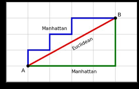

# K-Nearest Neighbors (KNN)
___

KNN, also known as a lazy model, is a **Supervised Learning Model** used for **Classification** and **Regression**. It can handle **non-linear data** and works by identifying the closest data points to make predictions.

## Key Concepts
- **K-neighbors**: To predict the outcome for a given point, we check the nearest `k` neighbors and make predictions based on their values. **Check similar points**. For example, if `k = 2`, we look at the two nearest neighbors and predict the outcome based on them.

## Use Case
- Like predicting the price of house, we can look price of nearest houses

## Advantages:
- Effective with smaller datasets that have fewer features.
- Suitable for both **Regression** and **Classification**.
- Easy to implement for **multi-class classification**.
- Flexible in terms of distance metrics (e.g., Euclidean, Manhattan).

## Disadvantages:
- Requires careful selection of the optimal "K" value.
- Inefficient with **high-dimensional** data.
- Performs poorly on **imbalanced datasets**.
- **Sensitive to outliers**.

## Distance Metrics
KNN uses different distance criteria, which are crucial for determining the similarity between points:

- **Euclidean Distance**: Most commonly used. It calculates the straight-line distance between two points.
- **Manhattan Distance**: Measures distance along axes at right angles.



### Key Insights:
- If the distance between two data points is **large**, the points are **dissimilar**.
- If the distance is **small**, the points are **more similar**.

## Code Implementation

```python
import numpy as np

# Euclidean distance example
p1 = (1,1,1)
p2 = (2,2,2)

euclidean_dist = np.sqrt(((p1[0] - p2[0])**2)  + ((p1[1] - p2[1])**2) + ((p1[2] - p2[2])**2))
print(euclidean_dist)

# General function to compute Euclidean distance
def get_euclidean_distance(p1, p2):
    dist = 0
    for i in range(len(p1)):
        dist += (p1[i] - p2[i])**2
    euclidean_dist = np.sqrt(dist)
    print("Euclidean distance (general method):", euclidean_dist)

get_euclidean_distance(p1, p2)

# Manhattan distance example
def get_manhattan_distance(p1, p2):
    dist = 0 
    for i in range(len(p1)):
        dist += abs(p1[i] - p2[i])
    print("Manhattan distance:", dist)

get_manhattan_distance((1,1,1,1), (2,2,2,2))
```
___
``` python
for i in range(len(dataset.values) - 1):
    get_manhattan_distance(dataset.values[i], dataset.values[i+1])
    get_euclidean_distance(dataset.values[i], dataset.values[i+1])
```

## Custom KNN Classifier
``` python
import statistics

class KNN_Classifier:
    def __init__(self, distance_metric):
        self.distance_metric = distance_metric

    def get_distance_metric(self, training_data_point, test_data_point):
        if self.distance_metric == 'euclidean':
            dist = 0
            for i in range(len(test_data_point) - 1):
                dist += (test_data_point[i] - training_data_point[i])**2
            return np.sqrt(dist)
        elif self.distance_metric == 'manhattan':
            dist = 0
            for i in range(len(test_data_point) - 1):
                dist += abs(test_data_point[i] - training_data_point[i])
            return dist

    def nearest_distance(self, X_train, test_data, k):
        distance_list = []
        for training_data in X_train: 
            dist = self.get_distance_metric(training_data, test_data)
            distance_list.append((training_data, dist))
        distance_list.sort(key=lambda x: x[1])
        neighbors = [distance_list[j][0] for j in range(k)]
        return neighbors

    def predict(self, X_train, test_data, k):
        neighbors = self.nearest_distance(X_train, test_data, k)
        labels = [data[-1] for data in neighbors]
        return statistics.mode(labels)
```


#### **Note:**      
##### Small K value → Highly complex model → Overfitting → Captures too much noise
This means the model will fit the data points very closely, even capturing noise and outliers in the dataset

