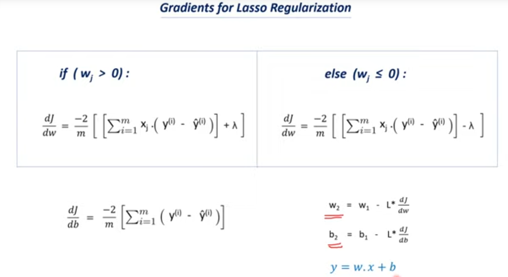

# Lasso Regression

- **Type**: Supervised Learning
- **Model**: Regression Model
- **Full Name**: Least Absolute Shrinkage and Selection Operator
- **Purpose**: Implements Regularization to avoid overfitting.

## Multiple Linear Regression

- Predicts the value of one dependent variable based on two or more independent variables.
- Represents the equation in a plane instead of a line:
    - **Simple Linear Regression**: \( Y = w_1 X_1 + b \)
    - **Multiple Linear Regression**: \( Y = w_1 X_1 + w_2 X_2 + \ldots + w_n X_n + b \)

## Regularization

- **Goal**: Reduce overfitting by adding a penalty term \( \lambda \) to the model.
- **Method**: Lasso regression uses the L1 regularization technique.
- **Effect**: Reduces coefficient values or eliminates some coefficients, leading to a simpler model.
- **Example**: For a 3rd-order polynomial, the equation is:
    - \( y = a(x^3) + b(x^2) + c(x) + d \)
- This process is called **Shrinkage**, indicating that only a few features are important.

### Cost Function for Lasso Regression

- Low cost value implies high accuracy:
  
  \[
  \text{Cost function} = \frac{1}{m} \left( \sum_{i=1}^{m} (y(i) - \hat{y}(i))^2 + \lambda \sum_{j=1}^{n} |w_j| \right)
  \]

  - \( m \) = total number of data points
  - \( n \) = number of features
  - \( y \) = true value
  - \( \hat{y} \) = predicted value
  - \( \lambda \) = penalty term
  - \( w \) = model parameters

## Gradient Descent for Lasso Regression



- The update rule:
  
  \[
  Y = mX + b
  \]

### Gradient Descent

- An optimization algorithm used to minimize the loss function in various machine learning models.
- Updates model parameters as follows:

  \[
  w = w - \alpha \cdot dw
  \]
  \[
  b = b - \alpha \cdot db
  \]

- **Learning Rate**: A tuning parameter that determines the step size at each iteration when moving towards the minimum of the loss function.

## Lasso Regression Class Implementation

```python
import numpy as np 

class LassoRegression():
    def __init__(self, learning_rate, n_iter, lambda_parameter):
        self.learning_rate = learning_rate
        self.n_iter = n_iter
        self.lambda_parameter = lambda_parameter
        
    def fit(self, X, Y):
        self.m, self.n = X.shape
        self.w = np.zeros(self.n)
        self.b = 0
        self.X = X
        self.Y = Y
        for i in range(self.n_iter):
            self.update_weights()

    def update_weights(self):
        y_prediction = self.predict(self.X)
        dw = np.zeros(self.n)
        
        for i in range(self.n):
            if self.w[i] > 0:
                dw[i] = (-2 * (self.X[:, i].dot(self.Y - y_prediction)) + self.lambda_parameter) / self.m
            else:
                dw[i] = (-2 * (self.X[:, i].dot(self.Y - y_prediction)) - self.lambda_parameter) / self.m
            
        db = -2 * np.sum(self.Y - y_prediction) / self.m   
        
        # Updating weight and bias
        self.w -= self.learning_rate * dw
        self.b -= self.learning_rate * db
        
    def predict(self, X):
        return X.dot(self.w) + self.b
```


