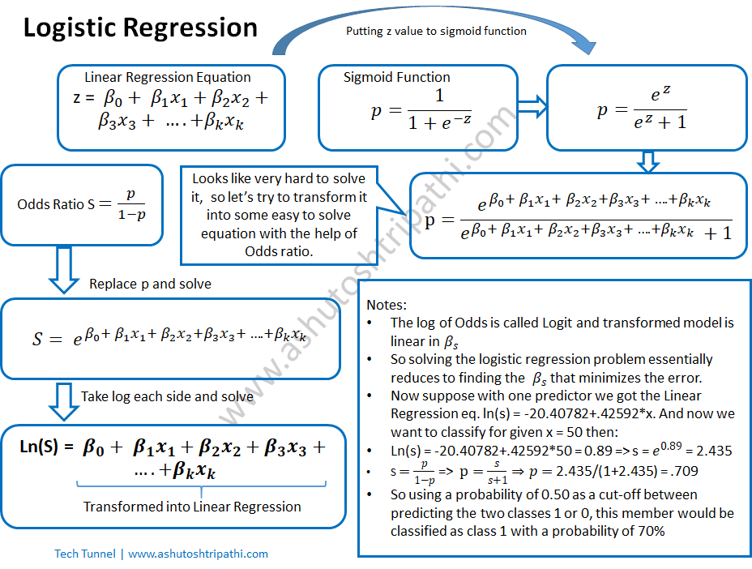

# Logistic Regression Overview

Logistic Regression is a **supervised learning model** primarily used for classification tasks, particularly suitable for **binary classification problems**. 

## Key Features

- **Classification Model**: It predicts categorical outcomes.
- **Sigmoid Function**: Utilizes an S-shaped curve to model probabilities.
  
  The sigmoid function is defined as:

  \[
  Y = \frac{1}{1 + e^{-z}}
  \]

  where \( z = wX + b \), and:

  - \( Y \) is the probability that \( y = 1 \)
  - \( X \) represents the input features
  - \( w \) denotes weights (equal to the number of input features)
  - \( b \) is the bias

  The sigmoid function outputs values between 0 and 1, which helps determine class membership. The decision boundary is at \( Y = 0.5 \).

- **Applicability**: Can be used for both binary and non-binary classification.



## Cost Function for Logistic Regression

The cost function quantifies how well the model performs. 

1. **Loss Function** (\( L \)): Primarily for large single training sets.

   \[
   L(y, y^*) = -(y \log y^* + (1 - y) \log(1 - y^*)
   \]

2. **Cost Function** (\( J \)): Handles a batch of training sets. Its like error , we should aim to minimize it.

   \[
   J(w, b) = \frac{1}{m} \sum_{i=1}^{m} \left( y(i) \log y^*(i) + (1 - y(i)) \log(1 - y^*(i)) \right)
   \]

   Here, \( m \) denotes the number of data points in the training set.

## Training Process

1. Initialize parameters (\( \theta \)).
2. Calculate \( y = \text{sigmoid}(\theta^T X) \) for each customer.
3. Compare the predicted output (\( y \)) with the actual output and compute the error.

## Gradient Descent for Logistic Regression

Gradient descent is an optimization algorithm used to minimize the cost function in various machine learning models. The update rule is given by:

\[
w^{(2)} = w^{(1)} - L
\]

### Implementation in Python

```python
import numpy as np

class Logistic_Regression:

    # Declaring learning rate & number of iterations (Hyperparameters)
    def __init__(self, learning_rate=0.01, no_of_iterations=1000):
        self.learning_rate = learning_rate
        self.no_of_iterations = no_of_iterations

    # Fit function to train the model with the dataset
    def fit(self, X, Y):
        self.m, self.n = X.shape  # Number of data points and input features

        # Initiating weight & bias value
        self.w = np.zeros(self.n)
        self.b = 0
        self.X = X
        self.Y = Y

        # Implementing Gradient Descent for Optimization
        for i in range(self.no_of_iterations):     
            self.update_weights()

    def update_weights(self):
        # Y_hat formula (sigmoid function)
        Y_hat = 1 / (1 + np.exp(- (self.X.dot(self.w) + self.b)))

        # Derivatives
        dw = (1/self.m) * np.dot(self.X.T, (Y_hat - self.Y))
        db = (1/self.m) * np.sum(Y_hat - self.Y)

        # Updating the weights & bias using gradient descent
        self.w -= self.learning_rate * dw
        self.b -= self.learning_rate * db

    # Sigmoid Equation & Decision Boundary
    def predict(self, X):
        Y_pred = 1 / (1 + np.exp(- (X.dot(self.w) + self.b)))
        Y_pred = np.where(Y_pred > 0.5, 1, 0)
        return Y_pred
```


Our_Model.predict_proba(X_test) -> This will give probability of each class to be happen like
    [[x1_1, x1_2], // if there are 2 element then    xi_2 -> 1 - xi_1
     [x2_1, x2_2],
     ----
    ]

